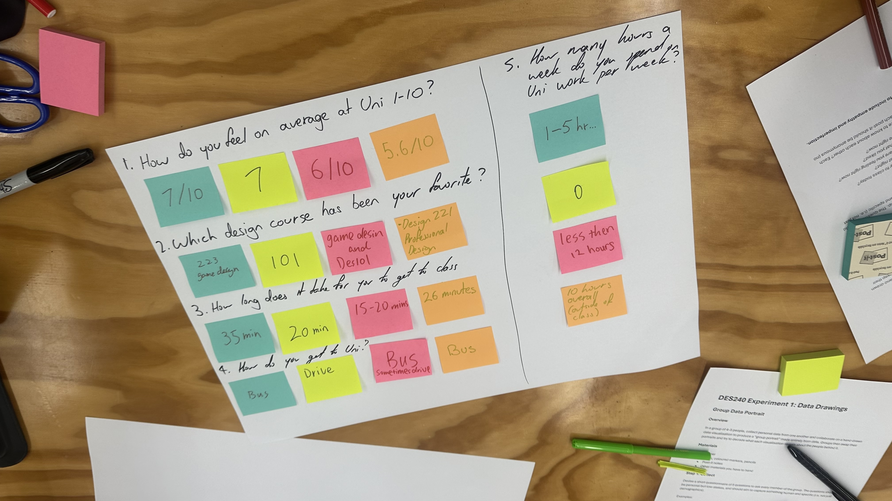
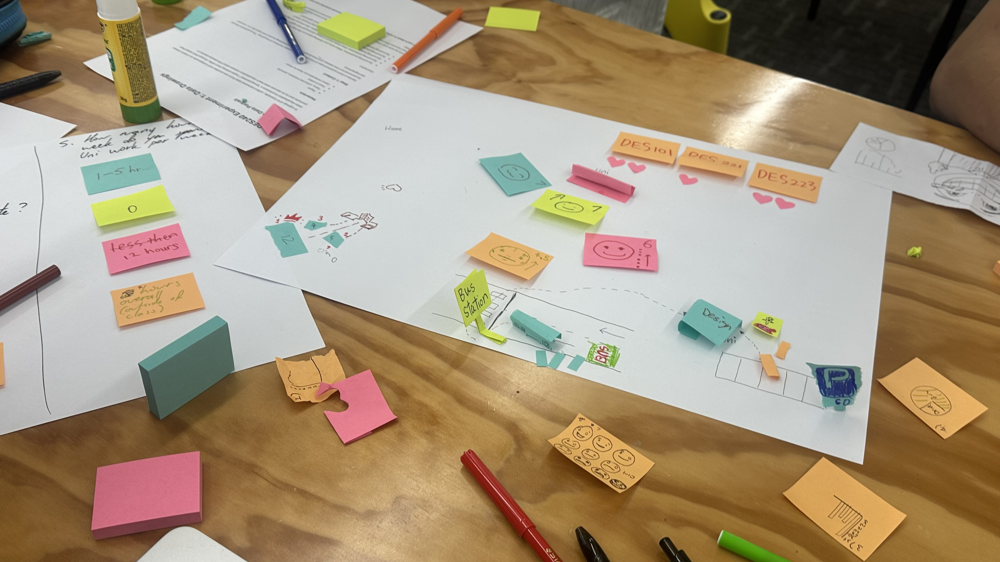

# Week 01

[← Back to Home](../index.md)

## Experiment 1: Data Drawings

### Group Data Portrait

### Overview

In this workshop activity, our group produced a collective data portrait based on personal but low-stakes information gathered from each group member. The aim of the exercise was to explore how qualitative and subjective experiences can be translated into a shared visual language without relying on names or direct identifiers.

We designed a short questionnaire and collected anonymous responses using post-it notes. These responses were then translated into a hand-drawn visual composition representing each participant through shapes, colours, and spatial arrangement. The drawing functioned as a collective portrait constructed entirely from data.

### Data Collection

Each group member responded to five short questions designed to capture small aspects of everyday experience. These questions focused on mood, recent activities, attention, and personal routines rather than demographic information.

All responses were written anonymously on individual post-it notes. This allowed the dataset to remain personal while removing direct identification, encouraging interpretation through visual encoding rather than labels.

The collected responses formed the dataset used to construct the collective portrait.

### Visual Encoding Strategy

After collecting the responses, we translated the dataset into a shared visual system.

Different colours represented emotional states reported by participants. Shapes were used to distinguish different individuals, while spatial arrangement across the page suggested relationships between responses. Size variations indicated intensity or duration where relevant.

A legend was included to explain the encoding system so that viewers could interpret the structure of the drawing without additional explanation.

Through this process, the drawing became not only a representation of data but also a visual interpretation of group dynamics.

## Reflection

This experiment helped me understand how data visualisation can represent subjective experiences instead of only numerical information. By translating everyday behaviours into visual elements such as colour, position, and shape, I learned how abstraction can communicate meaning clearly.

Working collaboratively also showed how different interpretations can coexist within one shared visual structure. The activity expanded my understanding of how design can function as a tool for representing relationships between people through data rather than statistics alone.

## Images & Media

Group questionnaire responses collected using post-it notes.

Translation of responses into a collective visual data portrait.

## AI Usage Statement

I used ChatGPT to help refine the grammar and structure of this documentation.